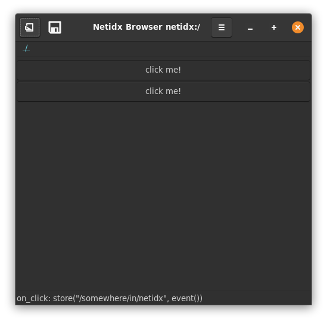

# Box

The box widget arranges it's child widgets either vertically or
horizontally. Box is one of the basic primitives of layout in the
browser. It supports the following static parameters,

- direction: either vertical or horizontal.
- homogeneous: if checked then the box will force all it's children to
  be the same size.
- spacing: how much empty space to include between each child widget.

Boxes can be nested to achieve various layout effects.

