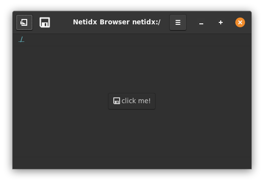
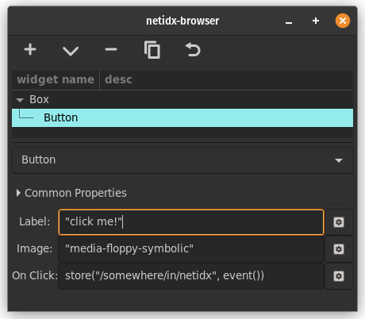

# Button

The button widget draws a clickable button. It has 3 bscript
properties,

- Label: The text to be drawn in the button.
- Image: The image to be drawn in the button. This field uses the same
  format as the image widget's spec property. The image will be drawn
  in addition to the text label, so if you want just an image leave
  the text blank.
- On Click: The `event()` function in this property will yield `null`
  when the user clicks the button.

