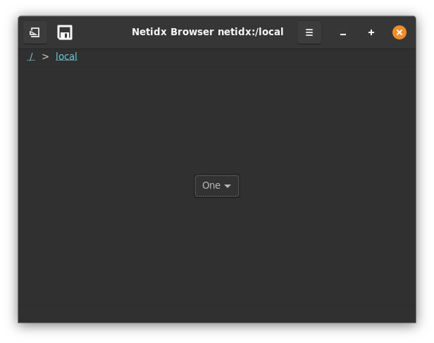
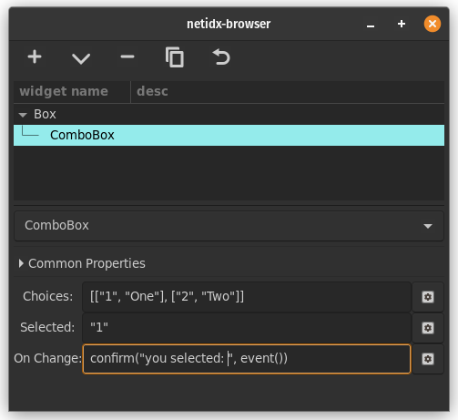

# Combo Box

The combo box widget allows the user to pick from a list of values. It
has 3 bscript properties,

- Choices: The list of allowed choices. This is a list of pairs. The
  first element of each pair is the string that will be sent by the
  `event()` function when the user selects the choice, and the second
  is the text that will be shown to the user.
  
  Example
  
  `[["1", "One"], ["2", "Two"]]`
  
  The combo box will have allowed choices "One" and "Two".
- Selected: This expression should resolve to one of the allowed
  choices. It controls what is displayed as selected in the combo
  box. Even if the user makes a different selection, if this property
  doesn't update the selected item won't change.
- On Change: `event()` in this expression will yield the key of the
  item the user has selected. The handler should arrange to update the
  selected property to reflect the user's change.
  

