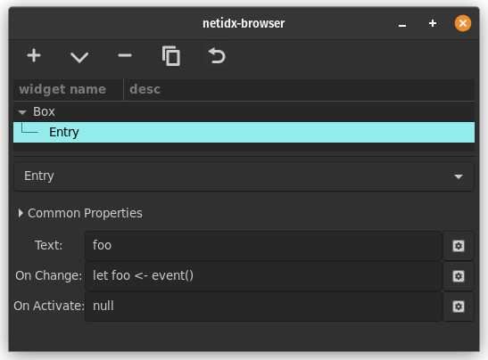

# Entry

Entry allows simple text entry. It has 3 bscript properties,

- Text: The text in the entry. This will be synced with the entry when
  it updates, or when the user activates the entry by pressing enter.
- On Change: `event()` in this expression will yield the text of the
  entry every time the user changes it.
- On Activate: `event()` in this expression will yield the text of the
  entry when the user presses enter.

