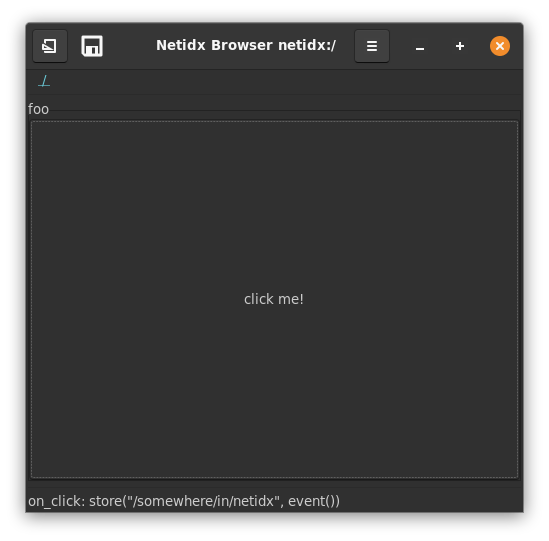
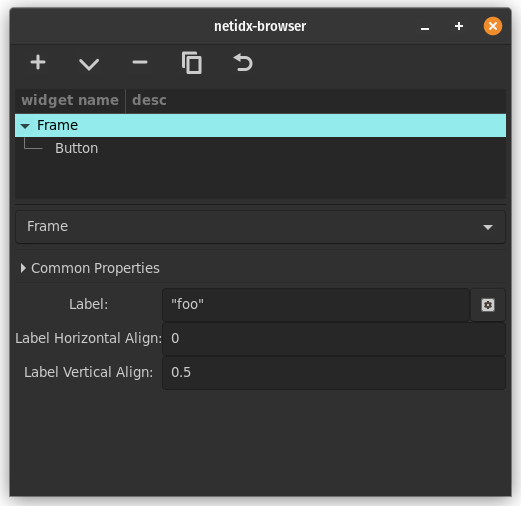

# Frame

The frame widget draws a frame around it's child widget, with an
optional label. It supports the following static layout parameters,

- label horizontal alignment: a floating point number between 0 and 1
  that controls the horizontal placement of the label, with 0 being
  the left and 1 being the right.
- label vertical alignment: a floating point number between 0 and 1
  that controls the label's placement relative to the upper line of
  the frame box. 0 being fully below the line, and 1 being fully above
  the line.
  
Frame also supports the following bscript parameters,

- label: The text of the label. If this is not a string then no label
  will be drawn.

