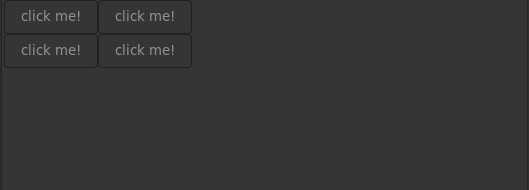
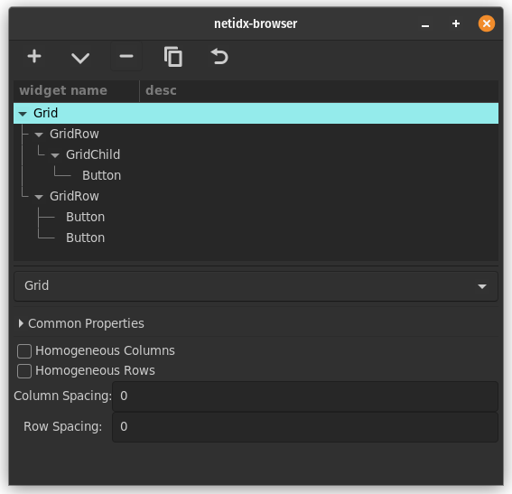

# Grid

The Grid widget allows you to layout widgets in a 2d grid. By default,
grid will make a row for each of it's children. However if the child
is a GridRow widget, then it's children will become
columns. Individual grid children may be configured with additional
parameters by placing them under GridChild widgets. This is a little
complex, but with it you can get a lot of control over your
layouts. The GridChild widget can tell the grid that a given widget
should be more than 1 columns wide, or more than 1 rows tall. GridRows
can be arranged to precisely define the rows and columns of the
widget, and you can see the layout change as you drag and drop widgets
around in the tree. The Grid widget supports the following static properties,

- homogeneous columns: If checked then all widgets in all columns are
  forced to be the same width.
- homogeneous rows: If checked then all widgets in all columns are
  forced to be the same height.
- column spacing: How much empty space to leave between each column
- row spacing: How much empty space to leave between each row

The GridChild widget supports the following static properties,

- width: The width, in columns, of this widget
- height: The height, in rows, of this widget

The GridRow widget is just a marker widget, it doesn't support any
properties.

