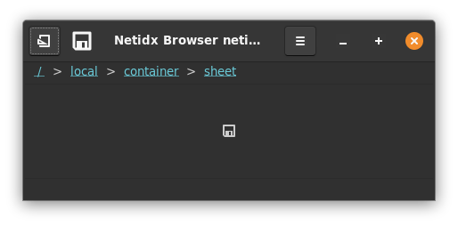
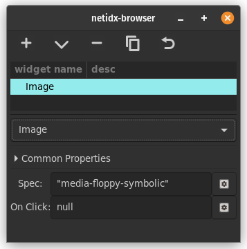

# Image



The image widget allows displaying an image in the browser. The image
has two bscript properties.

## spec

```

(<icon-name> | icon-spec | <image-bytes> | image-spec)

icon-spec: [<icon-name>, icon-size]

icon-size: ("menu" | "small-toolbar" | "large-toolbar" | "dnd" | "dialog")

image-spec: [
   ["image", <image-bytes>],
     required, the image bytes.

   ["width", <desired-width>],
     optional, if specified the image will be scaled to the
     specified width. If keep-aspect is true then the height
     will also be scaled to keep the image's aspect ratio even
     if height is not specified.

   ["height", <desired-height>],
     optional, if specifed the image will be scaled to the
     specified height. If keep-aspect is true then the width
     will also be scaled to keep the image's aspect ratio even
     if width is not specified.

   ["keep-aspect", (true | false)]
     optional, keep the aspect ratio of the image.
]
```

- <icon-name>: A string naming the stock icon from the current theme
  that should be displayed. The default size is "small-toolbar".
- icon-spec: A pair specifying the icon name and the icon size.
- icon-size: The size of the icon
- `<image-bytes>`: A bytes value containing the image in any format
  supported by gdk_pixbuf.
- image-spec: an alist containing the image bytes in any format
  supported by gdk_pixbuf and some metadata.

Examples,

`"media-floppy-symbolic"`

Display the icon from the standard icon set.

`<binary-png-data>`

Display the png data, literally the raw bytes copied into netidx
directly from the file.

## On Click

This event handler is triggered when the user clicks on the
image. `event()` will yield `null` when that happens.


