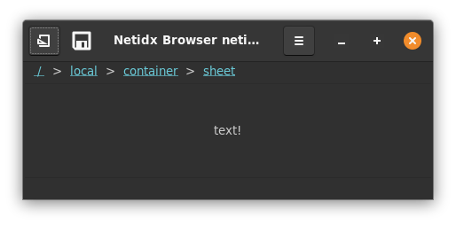

# Label

The label widget displays a text label. It has the following bscript
properties,

- Text: the contents of the label. If the value is not a string it
  will be converted to one.
- Min Width: The minimum desired width in characters. The widget will
  force the window to be at least this wide.
- Ellipsize Mode: one of "none", "start", "middle", or "end". This
  property defines what happens if the text is too large to fit in the
  widget.
  - "none": the window will be forced to grow until the text fits
  - "start": the text will be truncated and replaced with ... at the
    start.
  - "middle": the text will be truncated and replaced with ... in the
    middle.
  - "end": the text will be truncated and replaced with ... at the
    end.
- Single Line: if true then the label is restricted to a single line,
  newlines in the text are ignored. Otherwise it can span multiple
  lines.
- Selectable: if true then the text in the label is selectable, if
  false it is not.

