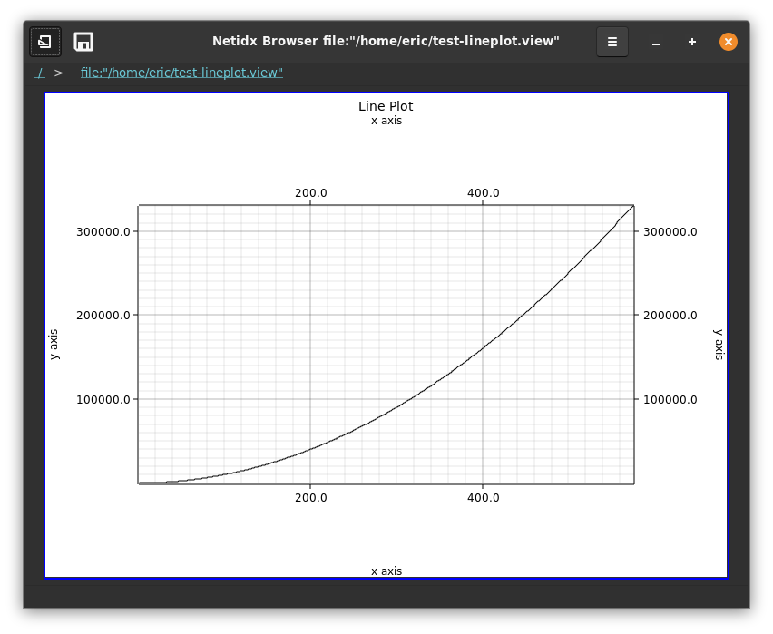
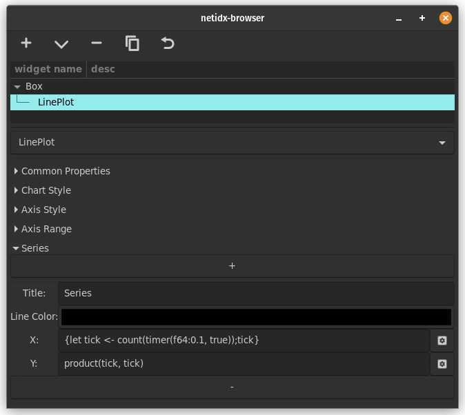

# Line Plot

The lineplot widget draws animated line plots with multiple series on
a plot and numerous configuration options.

## Chart Style

- Title: The title of the plot, shown on the top center.
- Fill: The background fill color, if any. If the box is unchecked
  then there will be no fill color
- Margin: The size of the chart margins
- Label Area: The size of the are reserved for the axis labels

## Axis Style

- X Axis Label: The label of the X axis
- Y Axis Label: The label of the Y axis
- X Labels: The maximum number of points on the X axis that get
  labeled
- Y Labels: The maximum number of points on the Y axis that get
  labeled
- X Axis Grid: Draw grid lines along the X axis
- Y Axis Grid: Draw grid lines along the Y axis

## Axis Range

- x min: The minimum value on the X axis. If `null` this will be computed from the data set.
- x max: The maximum value on the X axis. If `null` this will be computed from the data set.
- y min: the minimum value on the Y axis. If `null` this will be computed from the data set.
- y max: the maximum value on the Y axis. If `null` this will be computed from the data set.
- keep points: The number of points of history to keep.

## Series

There can be multiple series on a line plot, use the + and - buttons
to add/remove series from a plot.

- Title: The title of the series
- Line Color: The color of the line associated with the series
- X: The expression that generates the X coordinate of the series
- Y: The expression that generates the Y coordinate of the series

Example

`X: { let tick <- count(timer(f64:0.5, 1024)); tick }`

`Y: product(tick, tick)`

This will animate the plot of `y = x ^ 2` 2 points per second out to
`x = 1024`.

