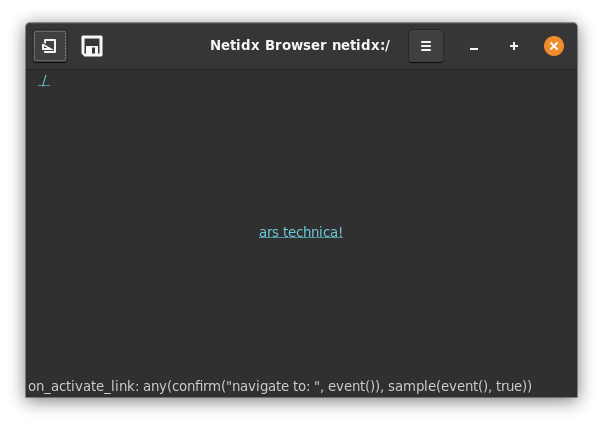

# Link Button



The link button draws a clickable hypertext link. It has 3 bscript
properties,

- Label: the text of the link
- URI: The URI of the link.
- On Activate Link: This event handler will be triggered when the link
  is clicked. The `event()` function will yield the uri. If the
  handler expression yields `true`, then the uri will be considered
  handled and no further action will happen. If the handler expression
  doesn't yield `true`, then the uri will be handled by the system.
  
  An https uri should open the requested page in the default browser,
  a file uri should open the specified location in the file
  manager. etc. Any uri the system knows how to handle should work.
  
  Example
  
  ```
  any(
    confirm("navigate to: ", event()), 
    sample(event(), true)
  )
  ```
  
  Ask the user if they want to navigate to the uri. If they say no,
  confirm won't update, and sample will update with true, so any will
  update with true, and the click event will be marked as fully
  handled. If they say yes, then confirm will update with the uri any
  will update with the uri, which isn't true, so the system handler
  will be invoked.


