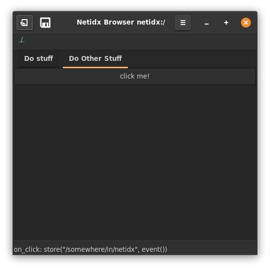
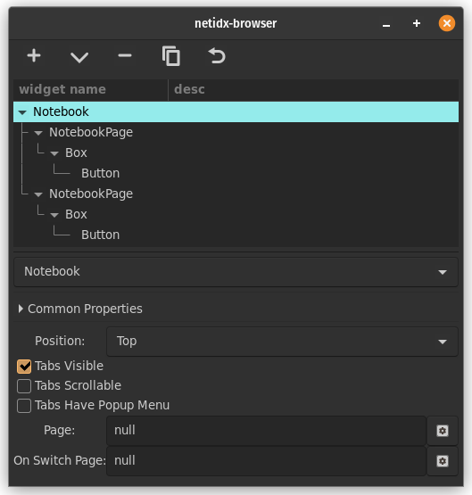

# Notebook

The notebook widget allows you to create essentailly a tabbed set of
windows that the user can select, or that you can select with
bscript. It supports the following static properties,

- position: The position of the tabs, top, left, bottom, or right.
- tabs visible: If this is not checked then the tabs won't be visible,
  bscript will be the only way to switch tabs.
- tabs scrollable: If you have too many tabs to fit on the screen
  checking this will make them scrollable.
- tabs have popup menu: If you have too many tabs to fit on the screen
  checking this will make a popup menu so the user can still select
  the tabs that don't fit.

As well as static properties the notebook widget also has bscript
properties,

- page: the 0 indexed page that is currently selected in the
  notebook. When this updates the notebook will change which page is
  shown.
- on switch page: event() will yield the 0 indexed page that the
  notebook is currently displaying. That is, event() will update when
  the page changes.

The NotebookPage widget can be placed under the notebook in order to
configure properties of each page. It has the following static properties,

- tab label: the name of the page that is displayed to the user
- reorderable: if checked then the user can reorder the pages by
  dragging them.

