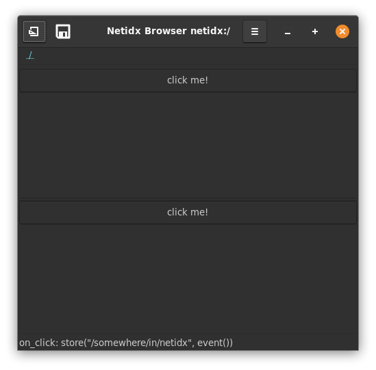
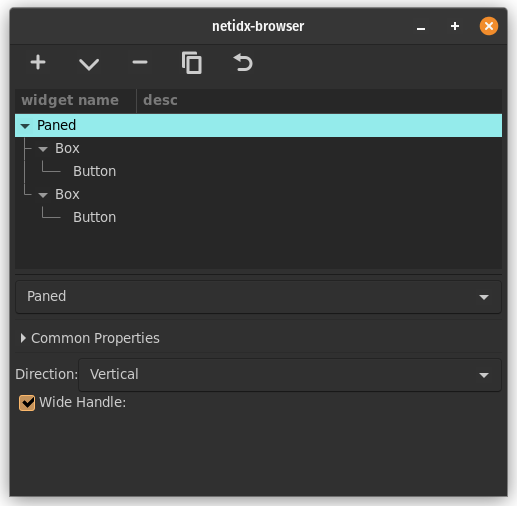

# Paned

The paned widget creates two user resizable sub regions of the
space. The division can be either vertical or horizontal. The Paned
widget supports the following properties,

- direction: either vertical or horizontal.
- wide handle: if checked the handles will be wider than the default

