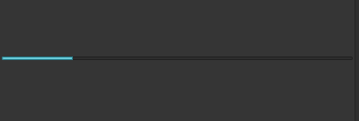
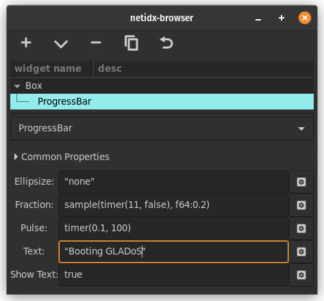

# Progress Bar

Progress bar displays the progress of some task that takes long enough
that you need to keep the user informed about it lest they get bored,
or think the application is stuck. It has several properties,

- Ellipsize: If the text is too large for the window it will be
  ellipsized according to this property. Possible values are, "none",
  "start", "middle", "end", which specify where the text will be
  truncated and replaced with ...
- Fraction: How far along the task is, expressed as a float between 0
  and 1.
- Pulse: If you don't know how long a task will take, but you still
  want to tell the user "stuff is happening", then you can set pulse
  to an expression that updates periodically. Each update will cause
  the progress bar to move. You can mix pulse and fraction, e.g. you
  can pulse for a while, and then set fraction, and then pulse for a
  while.
- Text: The text you wish to display above the progress bar,
  e.g. could describe what it's doing now.
- Show Text: `true` if you want to draw the text, `false` otherwise.

