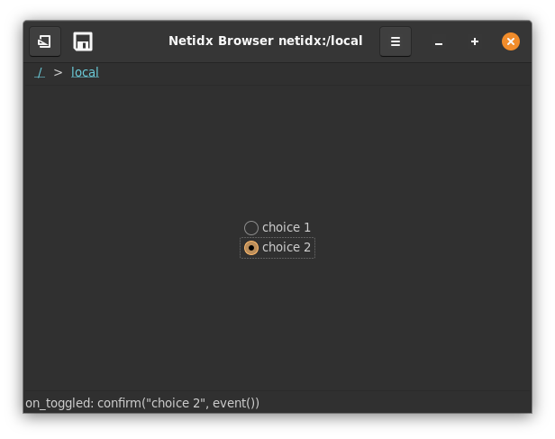
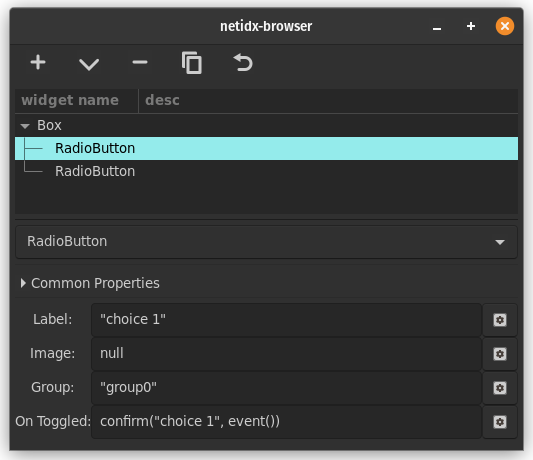

# Radio Button

Radio buttons allow the user to select from a set of options. Radio
buttons only work when there are two or more, as they are are grouped
together, and within each group only one radio button may be active at
a time. There are 5 bscript properties,

- Label: The text shown to the right of the radio button.
- Image: The image shown to the right of the radio button. This uses
  the same format as the image widget's spec property. If both image
  and text are present then both will be shown.
- Group: The name of the group this radio button belongs to. Only one
  button in each group may be active at any one time. If the user
  selects a new button in a group then current active button will
  toggle off and the new one will toggle on.
- Value: The value of the radio button, `true` the radio button is
  selected, `false` the radio button is not selected. If your
  expressions produce an inconsistent state for a given group, then
  the browser will pick one of the group members that is true to be
  the one button that is selected. If your expression doesn't update
  when the user selects an option, then the user's selection will
  override your value.
- On Toggled: `event()` called from this expression will yield `true`
  or `false` when the radio button toggles.

