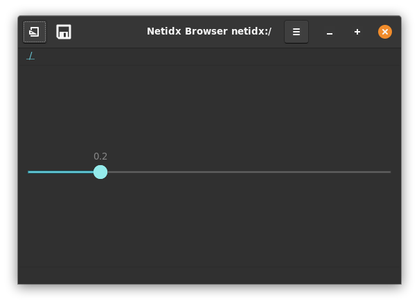
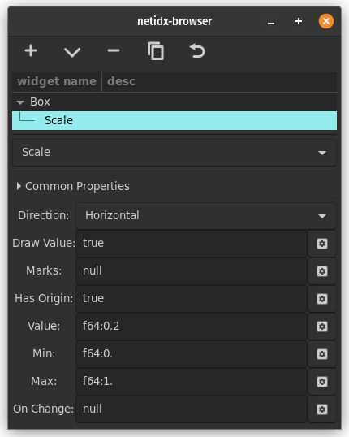

# Scale



Scale visualizes a floating point number between a minimum and maximum
value, and allows the user to drag the slider to change the value. It
has several properties,

## Direction
This static property indicates whether the slider is horizontal or
vertical.

## Draw Value
if `true` then the actual value is drawn, if `false` it is not.

## Marks

Allows displaying marks along the scale's axis. When dragging the
slider the browser will snap to the nearest mark, making these values
easy to hit exactly.

```
[mark, ...]

mark: [<pos>, position-spec, (null | <text>)]

position-spec: ("left" | "right" | "top" | "bottom")
```

Example

```
[
  [0.25, "bottom", "0.25"], 
  [0.5, "bottom", "0.5"], 
  [0.75, "bottom", "0.75"]
]
```

Will draw marks at 1/4, 1/2, and 3/4 along the axis on the bottom
side.

## Has Origin

If this propery is `true` then the left or top of the scale is
considered the origin, and the part from there to the handle will be
filled in.

## Value

This defines the position of the handle. It must be between the
minimum and maximum values.

## Min

The minimum value, this defines the origin if Has Origin is true.

## Max

The maximum value.

## On Change

`event()` in this expression will yield the value of the slider
whenever the user changes it.


