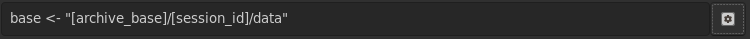

# Language Overview

The browser scripting language exists to glue the widgets in your gui
to the inputs and outputs in netidx, and to compute your formulas in
the container. If you're familiar with the model view controller gui
paradigm, browser script is the controller layer. Because of it's
purpose it works differently from most scripting languages, in that it
is a 'reactive' or 'incremental' language. Instead of describing
"steps the computer performs when I click the button" like most other
languages, browser script describes where events go, and what
transformations happen to them.

For example the event handler for a button might look like so,
```
store("[base]/app/do_action", event())
```

Store is a function that takes two event sources as arguments. The
first is expected to describe where in netidx to write, and the second
provides the values that are written.  We can think of this expression
as building an event pipeline that looks something like this,

```
get(base) ------------1-> concat_string ---------
                                ^                |
                                |                |
"/app/do_action" -------------2-                 1
                                                 v
event() -----------------------------------2-> store
```

- When the user performs an action `event()` emits a `Null` which is
  received by `store` and ultimately either written right away to the
  path specified by store's first argument, or retained until store's
  first argument is a valid path.
- When the value of `base` is changed it's new value is emitted to
  `concat_string`, which concatinates it with it's second argument (a
  constant) and emits the result to store. Store will then either wait
  for event to emit a value, or if event has already emitted a value
  in the past then store will write that value to the new path it just
  received.

# Compile Time vs Run Time

When a view is first loaded all BScript expressions in it are compiled
into event graphs like the one visualized above. From then on, as the
view runs, events are generated and flow through the graphs, but no
additional compilation takes place.

The only exception to this rule is the `eval` function, which compiles
and executes new BScript code on the fly from a string.

Since all BScript expressions are compiled at view load time, if you
write an expression that just immediatly does something, then whatever
it does will happen when the view is loaded. That holds true no matter
where you put it, e.g. say we put the following as the `enabled`
expression of a toggle.

`any(true, store("/foo/bar", 42))`

Since `any` always returns the left most event it receives, it will
evaluate to true, making the toggle enabled, however every time the
view containing this expression is loaded `42` will also be stored at
`/foo/bar`.

It's important to understand these semantics if you want to write more
complex applications using BScript. The bscript widget is an invisible
widget specifically meant for setting up these "background" event
graphs. For example, we might want to have a variable called `base`
that contains the base relative to which our view will operate. We can
easily reference this variable in all our widgets, and the correct way
to set it's value would be to put it's initialization expression in a
bscript widget. e.g.

```
base <- load("/where")
```

# Scope

Bscipt variables are lexically scoped, both in terms of their lexical
position in code, and the position of the widget they attach to, or in
the case of the container their base path in netidx. Container widgets
such as Box, Grid, Paned, etc introduce new scopes, so bscripts that
are compiled in the context of these widgets may set local variables
that are not visible above them. Local variable bindings are made
using,

```
let var <- expr
```

This will bind a local variable `var` to `expr`in the current scope,
or will assign to an already bound local variable in the current
scope. If a variable of the same name exists in a parent scope, that
variable will be shadowed in the current scope and below, but it's
value will not be assigned, and it will remain unchanged in higher and
sibling scopes.

The bare assignment assigns to the variable in the closest scope with
a matching name, and if there is no such vaiable, then it binds a
global variable.

```
var <- expr
```

Either assigns to the local variable `var` in the current scope, or
any parent scope, if it exists, or it binds `var` to `expr` in the
global scope.

The do expr, `{ expr; expr; ... }`, introduces a new lexical scope
unless it is the toplevel do in a script expression. e.g.

```
{
   let var <- expr;
   ...
}
```

`var` has the same scope as

```
let var <- expr
```

However,

```
{
   ...;
   {
       let var <- expr;
       ...
   }
   ...
}
```

In this case the inner do expr introduces a new lexical scope, so
`var` is only visible inside that scope and it's child scopes. You can
think of this as each toplevel script expr allowing multiple
statements at the top level. For code concision we are allowed to omit
the curly braces when we only have one statement

e.g. every toplevel bscript expression is implicitly,

```
{ expr }
```

but we can just write

```
expr
```

# Types and Constants

Types in browser script correspond to the netidx value type, and are
named,

- u32: unsigned 4 byte integer
- v32: unsigned leb128 encoded integer
- i32: signed 4 byte integer
- z32: signed leb128 zig-zag encoded integer
- u64: unsigned 8 byte integer
- v64: unsigned leb128 encoded integer
- i64: signed 8 byte integer
- z64: signed leb128 zig-zag encoded integer
- f32: single precision floating point number
- f64: double precision floating point number
- bool: boolean
- string: unicode string
- bytes: byte array
- array: an array of values (including arrays)
- result: ok or error:description of error

Constants may be prefixed with the type name followed by a colon, e.g.

`f32:3.14`

However constant expressions have a default type if none is specified,

- floating point numbers: f64
- integers: i64
- strings: string
- true/false: bool
- ok: result

e.g. `3.1415` is the same as `f64:3.1415`, and both forms will be
accepted.

Arrays may be specified with the syntax `[ expr, expr, ... ]`, where
expr is a regular bscript expression. In the case that any of the
expressions defining an array update, the entire array will be
regenerated with the new value substituting for the old one.

```
[ load("/foo"), load("/bar") ]
```

Will generate a new pair whenever either foo or bar update.

# Expression Interpolation

In a string literal you may substitute any number of expressions by
surrounding them with `[]`. To produce a literal `[` or `]` you must
escape them with `\`, e.g. `\[` and `\]`. To produce a literal `\` you
may escape it as well, e.g. `\\`. Any expression is a valid
interpolation (including another interpolation). Non string valued
expressions will be cast to strings, and any expression that cannot be
cast to a string will be replaced with the empty string.

e.g.
```
"[base]/some/path" => string_concat(get("base"), "/some/path")
```

```
"[base]/bar/[if(load("[base]/enabled"),"enabled","disabled")]/thing" => 
string_concat(
    get("base"),
    "/bar/",
    if(
        load(string_concat(get("base"), "/enabled")),
        "enabled",
        "disabled"
    ),
    "/thing"
)
```

# The Expression Inspector

The expression inspector shows a tree representation of a BScript
expression in it's first column, and the current value of the
corresponding expression in it's second.


In this case the expression being inspected is,

```
base <- "[archive_base]/[sessionid]/data"
``` 

You can access the expression inspector by pressing the toggle button
to the right of the expression box.


