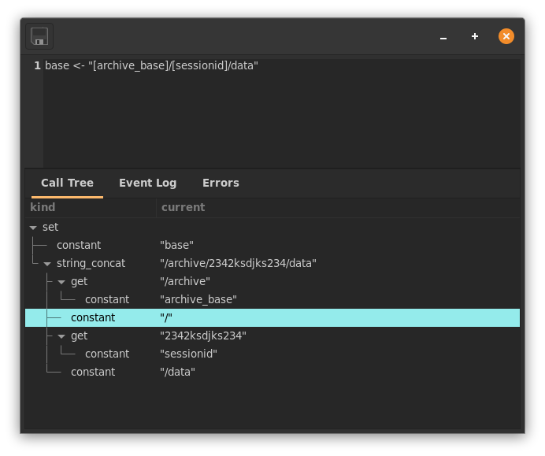

# Language Overview

The browser scripting language exists to glue the widgets in your gui
to the inputs and outputs in netidx. If you're familiar with the model
view controller gui paradigm, browser script is the controller
layer. Because of it's purpose it works rather differently from most
scripting languages, in that it is a 'reactive' or 'incremental'
language. Instead of describing e.g. "steps the computer performs when
I click the button" like most other languages browser script describes
the plumbing that events flow through on their way to their final
destination.

For example the event handler for a button might look like so,
```
store("[base]/app/do_action", event())
```

The store function writes it's 2nd argument to the netidx path
specified by it's first argument. The event function produces a widget
specific event, in this case it produces a Null whenever the button is
clicked. The path argument is actually a string with an expression
interpolation that will generate the path we will write to. So we can
think of this expression as building an event pipeline that looks
something like this,

```
get(base) ------------1-> concat_string ---------
                                ^                |
                                |                |
"/app/do_action" -------------2-                 1
                                                 v
event() -----------------------------------2-> store
```

- When the button is clicked the `event()` node emits a `Null` which
  is received by `store` and ultimately either written right away to
  the path specified by store's first argument, or retained until
  store's first argument is a valid path.
- When the value of `base` is changed it's new value is emitted to
  `concat_string`, which concatinates it with it's second argument (a
  constant) and emits the result to store. Store will then either wait
  for event to emit a value, or if event has already emitted a value
  in the past then store will store that value to the new path
  (assuming it's valid) it just received.

# Compile Time vs Run Time

When a view is first loaded all BScript expressions in it are compiled
into event graphs like the one visualized above. From then on, as the
view runs, events are generated and flow through the graphs, but no
additional compilation takes place.

The only exception to this rule is the `eval` function, which compiles
and executes new BScript code on the fly from a string.

Since all BScript expressions are compiled at view load time, if you
write an expression that just immediatly does something, then whatever
it does will happen when the view is loaded. That holds true no matter
where you put it, e.g. say we put the following as the `enabled`
expression of a toggle.

`any(true, store("/foo/bar", 42))`

Since `any` always returns the left most event it receives, it will
evaluate to true, making the toggle enabled, however every time the
view containing this expression is loaded `42` will also be stored at
`/foo/bar`.

It's important to understand these semantics if you want to write more
complex applications using BScript. The action widget is an invisible
widget specifically meant for setting up these "background" event
graphs. For example, we might want to have a variable called `base`
that contains the base relative to which our view will operate. We can
easily reference this variable in all our widgets, and the correct way
to set it's value would be to put it's initialization expression in an
action. e.g.

```
store_var(
  "base",
  load("/where")
)
```

# Types and Constants

Types in browser script correspond to the netidx value type, and are
named,

- u32: unsigned 4 byte integer
- v32: unsigned leb128 encoded integer
- i32: signed 4 byte integer
- z32: signed leb128 zig-zag encoded integer
- u64: unsigned 8 byte integer
- v64: unsigned leb128 encoded integer
- i64: signed 8 byte integer
- z64: signed leb128 zig-zag encoded integer
- f32: single precision floating point number
- f64: double precision floating point number
- bool: boolean
- string: unicode string
- bytes: byte array
- array: an array of values (including arrays)
- result: ok or error:description of error

Constants may be prefixed with the type name followed by a colon, e.g.

`f32:3.14`

However constant expressions have a default type if none is specified,

- floating point numbers: f64
- integers: i64
- strings: string
- true/false: bool
- ok: result

e.g. `3.1415` is the same as `f64:3.1415`, and both forms will be
accepted.

Array literals may be specified with the syntax `[ v0, v1, ... ]`

# Expression Interpolation

In a string literal you may substitute any number of expressions by
surrounding them with `[]`. To produce a literal `[` or `]` you must
escape them with `\`, e.g. `\[` and `\]`. To produce a literal `\` you
may escape it as well, e.g. `\\`. Any expression is a valid
interpolation (including another interpolation). Non string valued
expressions will be cast to strings, and any expression that cannot be
cast to a string will be replaced with the empty string.

e.g.
```
"[base]/some/path" => string_concat(get("base"), "/some/path")
```

```
"[base]/bar/[if(load("[base]/enabled"),"enabled","disabled")]/thing" => 
string_concat(
    get("base"),
    "/bar/",
    if(
        load(string_concat(get("base"), "/enabled")),
        "enabled",
        "disabled"
    ),
    "/thing"
)
```

# The Expression Inspector

The expression inspector shows a tree representation of a BScript
expression in it's first column, and the current value of the
corresponding expression in it's second.



In this case the expression being inspected is,

```
base <- "[archive_base]/[sessionid]/data"
``` 

You can access the expression inspector by pressing the toggle button
to the right of the expression box.

# Reference

## all

```
all(Expr, ..., Expr)
```

All produces the value of it's first argument if the values of all
it's arguments are equal.

```
all(11, load("/volume"))
```

Will produce 11 only when `/volume` is 11.

## and

```
and(Expr, ..., Expr)
```

Produces true if all of it's arguments are true, otherwise false.

e.g.
```
and(load("/cake"), load("/diet"))
```

Would produce false.

## any

```
any(Expr, ..., Expr)
```

Any produces an event every time any of it's arguments produce an event.

```
any(42, load("/foo/bar"), load("/foo/baz"))
```

Will produce 42, and then all the updates to `/foo/bar` and `/foo/baz`
in whatever order they arrive.

```
mean(any(load("/bench/0/0"), load("/bench/0/1")))

```

Will produce the average of the values of `/bench/0/0` and
`/bench/0/1`.

## call

```
call(rpc: Expr, Expr, ..., Expr)
```

Call the netidx rpc specified by the first argument, passing the
specified keyword arguments, and producing the return value of the
call. Keyword arguments are encoded as pairs of a name followed by a
value.

e.g.
```
set(
  "sessionid",
  call(
    "/solar/archive/session", 
    "start", "-10d", 
    "speed", "unlimited", 
    "play_after", "2s"
  )
)
```

call `/solar/archive/session` with arguments to replay the last 10
days, starting 2 seconds after the call finishes, at unlimited speed,
and store the resulting session id in the variable sessionid.

## cast

```
cast(Expr, Expr)
```

Attempt to cast the second argument to the type specified by the
first. Produce a value of the specified type, or an error if the cast
is not possible.

e.g.
```
cast("f32", load("/volume"))
```

Changes volume into a single precision float if possible.

## cmp

```
cmp(Expr, Expr, Expr)
```

Produces the result of performing the comparison specified by it's
first argument to it's 2nd and third arugments. Valid comparisons are
encoded as strings, and are called,

- eq: true if the arguments are equal
- lt: true if the first argument is less than the second one
- lte: true if the first argument is less than or equal to the second one
- gt: true if the first argument is greater than the second one
- gte: true if the first argument is greater than or equal to the second one

e.g.
```
cmp("lt", load("/volume"), 11)
```

is true if the volume is less than 11, false otherwise.

## confirm

```
confirm(msg: Expr, val: Expr)
```

Asks the user msg with val appended, and if they say yes produces it's
second argument, otherwise does not produce anything.

e.g.
```
store(
  "[base]/volume", 
  confirm(
    "are you sure you want to change the volume to ", 
    volume
  )
)
```

Asks the user to confirm before writing the value of the variable
`volume` to `[base]/volume`.

## contains

```
contains(sub: Expr, string: Expr)
```

contains is true if it's arguments are both strings, and it's first
argument is a substring of it's second argument.

e.g
```
contains("bar", "foobarbaz")
```

is true

## count

```
count(Expr)
```

Produces the count of events produced by expr since we started
execution of the pipeline.

e.g.
```
count(load("/volume"))
```

will increment every time volume changes.

## divide

```
divide(Expr, Expr, ..., Expr)
```

Divides it's first argument by it's subsuquent arguments.

```
divide(load("/volume"), 2, load("/additional_divisor"))
```

First divides `"/volume"` by 2 and then divides it by
"/additional_divisor".

## do

```
do(Expr, ..., Expr)
{ Expr; ...; Expr }
```

Do evaluates to the value of it's final argument, all other arguments
are evaluated for side effect. Each do block aside from the toplevel
one introduces a new lexical scope, let variables defined in such a
scope are not visible outside it.

e.g.
```
{
    let foo <- "Hello world!";
    store("/tmp/foo", foo);
    foo
}
```

evaluates to "Hello world!", but also sets the variable "foo", and
stores it's value to "/tmp/foo".

## ends_with

```
ends_with(Expr, Expr)
```

ends_with is true if both it's arguments are strings, and the second
argument ends with the first argument.

e.g.
```
ends_with("foo", "metasyntacticfoo")
ends_with("hello", "hello world")
```

The first ends_with is true, and the second one is false

## eval

```
eval(Expr)
```

Compiles and executes the browser script program specified by it's
argument, or produces an error if the program is invalid.

e.g.
```
eval(load("[base]/program"))
```

Load and execute browser script from `[base]/program`.

## event

```
event()
```

Produces a widget specific event depending on which widget and which
event handler the pipeline containing it is attached to. For example,
when attached to an entry `on_change` handler it produces the string
value of the entry whenever the user changes the text. When attached
to the on_activate handler of the entry, it produces the string value
of the entry when the user presses the Enter key. When attached to the
`on_click` handler of a button, it produces Null every time the button
is clicked.

e.g.
```
store("/text", event())
```

When attached to the `on_change` event of an entry would write the
text to `/text` every time the user changes it.

## filter

```
filter(predicate: Expr, Expr)
```

filter evaluates to it's second argument if it's first argument
evaluates to true, otherwise it does not pass any events. Note: When
the predicate transitions from false to true then filter will
immediatly evaluate to the last value of it's second argument that it
saw.

e.g.
```
filter(load("[enabled]"), load("[thing]"))
```

Passes on updates to "[thing]" only if "[enabled]" is true

## if

```
if(Expr, Expr, [Expr])
```

Produces the value of it's 2nd argument if it's first argument is
true, otherwise produces the value of it's third argument, or nothing
if it has no third argument.

e.g.
```
if(
    cmp("lt", load("/volume"), 11),
    load("/normal_amp"),
    load("/this_one_goes_to_11")
)
```

If "/volume" is less than 11 then the value is `"/normal_amp"`,
otherwise the value is `"/this_one_goes_to_11"`.

e.g.
```
if(cmp("eq", 11, load("/volume")), "huzzah!")
```

Produces `"huzzah!"` if `/volume` is `11`, otherwise nothing.

## isa

```
isa(Expr, Expr)
```

Produce true if the 2nd argument is the type named by the first
argument, false otherwise.

e.g.
```
isa("f32", 10)
```

would produce false.

## is_error

```
is_error(Expr)
```

is_error evaluates to true if it's argument evaluates to an error.

e.g.
```
do(
    set("val", load("/tmp/thing")),
    if(is_error(val), "#REF", val)
)
```

if load("/tmp/thing") fails then evaluate to "#REF" otherwise to the
value of load("/tmp/thing").

## load

```
load(Expr)
```

Subscribes to the netidx path specified by it's argument, which must
evaluate to a string.

e.g.
```
load("/some/path/in/netidx")
load("[base]/thing")
```

## get

```
get(var: Expr)
var
```

Produce the value of the variable specified by var, or an error if var
is not a valid variable name. The second form is syntactic sugar that
translates into `get("var")`.

## max

```
max(Expr, ..., Expr)
```

Produces the largest value of any of it's arguments.

e.g.
```
max(5, load("/volume"))
```

produces the value of "/volume" if it is greater than 5, otherwise it
produces 5.

## mean

```
mean(Expr)
```

Computes the average of it's argument over time.

e.g.
```
mean(load("/volume"))
```

Produce the average volume over the observed time period.

## min

```
min(Expr, ..., Expr)
```

Produces the smallest value of any of it's arguments.

e.g.
```
min(42, load("/volume"))
```

produces the value of `"/volume"` if it is less than 42, otherwise it
produces 42.

## navigate

```
navigate(Expr)
```

Navigate the browser to the location specified by it's first
argument. The syntax of a location is one of, 

- a valid absolute netidx path, e.g. /foo/bar/baz
- a view file e.g. file:/path/to/view/file
- a netidx: prefixed netidx path, e.g. netidx:/foo/bar/baz

e.g.
```
navigate(confirm("go to ", "file:[next_view]"))
```

## not

```
not(Expr)
```

Produces the opposite of it's argument, e.g. true if it's argument is
false, false otherwise.

e.g.
```
not(load("/solar/control/charging"))
```

true if the battery is not charging.

## or

```
or(Expr, ..., Expr)
```

Produces true if any of it's arguments is true, otherwise false.

e.g.
```
or(load("/cake"), load("/death"))
```

Would produce true.

## product

```
product(Expr, ..., Expr)
```

Produces the product of it's arguments.

e.g. 
```
product(2, 2)
```

## replace

```
replace(pat: Expr, replacement: Expr, val: Expr)
```

assuming all it's arguments are strings then replace evaluates to val
with all instances of pat replaced with replacement.

e.g.
```
replace("foo", "bar", "foobarbaz")
```

evaluates to "barbarbaz"

## sample

```
sample(Expr, Expr)
```

Produces the value of it's second argument when it's first argument
updates.

e.g.
```
sample(load("[base]/timestamp"), load("[base]/voltage"))
```

Produces `[base]/voltage` whenever `[base]/timestamp` updates.

## starts_with

```
starts_with(pat: Expr, val: Expr)
```

evaluates to true if both it's arguments are strings, and the second
argument starts with the first.

e.g.
```
starts_with("Hello", "Hello World!")
```

evaluates to true

## store

```
store(path: Expr, val: Expr)
```

store writes val to the specified path assuming it is valid. Store
does not evaluate to anything (in the future it may evaluate to the
result of the store).

A new write will be initiated each time the value of either argument
changes. For example, if the path changes to a new valid path, then
the most recent val will be written immediatly to that new path.

e.g.
```
store("/tmp/thing", 42)
```

write 42 to /tmp/thing

## set

```
set(name: Expr, val: Expr)
name <- val
```

Store the value of val in the variable specified by name. Return
nothing, or an error if name is not a valid variable name. Set will
set the variable defined in the lexical scope closest to it. If the
variable is not defined yet, then set will set it in the global
scope. The second form is a more consise syntax for the first, however
it is less powerful, as name must be a literal name and may not be an
expression.

e.g.
```
set("volume", cast("f32", event()))
```

## let

```
let(name: Expr, val: Expr)
let name <- val
```

Let is does the same thing as set except that it always sets the
variable in it's own lexical scope. If no variable is defined in it's
lexical scope, then it will define it there. If the variable is
defined in a parent scope, let will cause it to be masked in the
current scope and it's children.

e.g.
```
{
    let v <- 42;
    {
        let v <- 43;
        v
    }; # evals to 43
    v
} # evals to 42
```

## string_concat

```
string_concat(Expr, ..., Expr)
```

Concatinate all arguments.

e.g.

```
string_concat(load("/foo"), load("/bar"), "baz")
```

is the same as writing `"[load("/foo")][load("/bar")]baz"`. And in
fact string interpolations are just syntactic sugar for this function.

## string_join

```
string_join(sep: Expr, ..., Expr)
```

Concatinate all arguments from 2 ... n using the first argument as a
separator.

e.g.

```
string_join("/", base, "foo", "bar")
```

is the same a writing `"[base]/foo/bar"`

## strip_prefix

```
strip_prefix(pfx: Expr, val: Expr)
```

assuming both it's arguments are strings, then strip_prefix evaluates
to val with pfx removed from the beginning.

e.g.
```
strip_prefix("Hello ", "Hello World!")
```

evaluates to "World!"

## strip_suffix

```
strip_suffix(sfx: Expr, val: Expr)
```

assuming both it's arguments are strings, then strip_suffix evaluates
to val with sfx removed from the end.

e.g.
```
strip_suffix(" World!", "Hello World!")
```

evaluates to "Hello"

## sum

```
sum(Expr, ..., Expr)
```

Produces the sum of it's arguments.

e.g.
```
sum(load("/offset"), load("/random"))
```

sums `/offset` and `/random`

## trim_end

```
trim_end(Expr)
```

if it's argument is a string, then trim_end evaluates to it's argument
with trailing whitespace removed.

e.g
```
trim_end("123456   ")
```

evaluates to "123456"

## trim

```
trim(Expr)
```

if it's argument is a string, then trim evalutes to it's argument with
both leading and trailing whitespace removed.

e.g.
```
trim(" aaaaaaaaahhhg  ")
```

evaluates to "aaaaaaaaahhhg"

## trim_start

```
trim_start(Expr)
```

if it's argument is a string, then trim_start evaluates to it's argument
with leading whitespace removed.

e.g
```
trim_start("   123456")
```

evaluates to "123456"

## uniq

```
uniq(Expr)
```

Produces the value of it's argument only if that value is different
from the previous one.

e.g.
```
uniq(load("[stock_base]/ibm/last"))
```

Would produce an event only when the last trade price of IBM changes.
