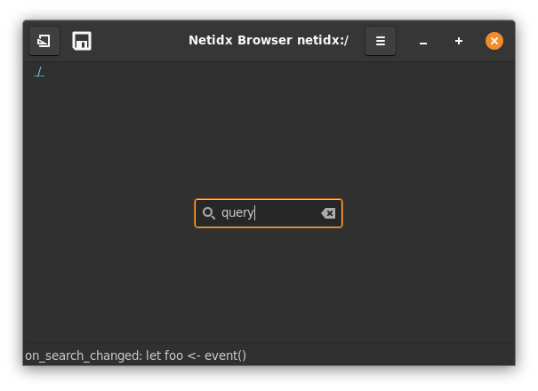
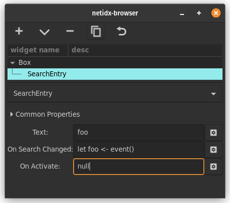

# Search Entry

Search entry is very similar to entry, with two differences. It has
iconography indicating what it does and a convenient button to clear
it in one click, and it imparts a slight delay before calling On
Search Changed. Like entry it has three bscript properties,

- Text: as with entry this is the text in the search entry. It is
  synced whenever it updates, or when the user activates the search
  entry by pressing enter.
- On Search Changed: `event()` in this expression will yield the text
  of the entry when it changes, but after a slight delay.
- On Activate: `event()` in this expression will yield the text of the
  entry when the user activates the entry by pressing enter.

