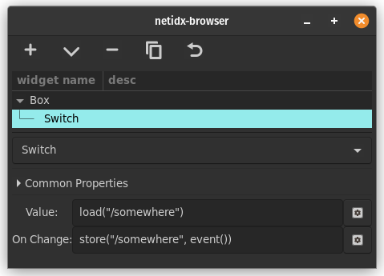

# Switch

Switch draws a physically inspired switch. The user can toggle the
switch by clicking it, however it's state is controlled by bscript. It
has two bscript properties,

- Value: The value of the switch. If this is any value except `false`
  or `null` then the switch is on. If it is `false` or `null` then the
  switch is off.
- On Change: `event()` in this expression will yield the new requested
  state of the switch as a bool. `false` for off `true` for on. This
  handler has no direct effect on the state of the switch, instead the
  value should be stored such that the Value expression updates with
  the new state.

