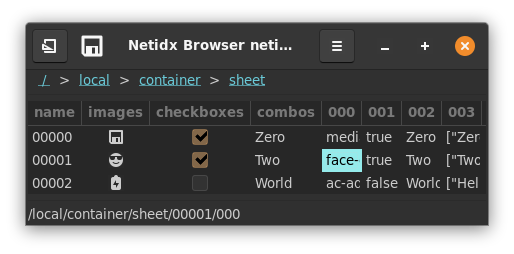
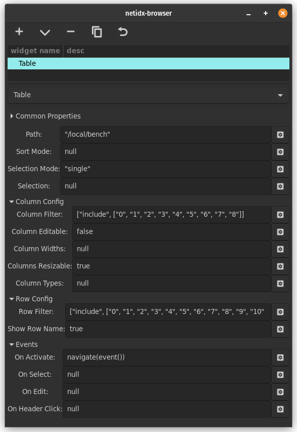

# Table


The table widget is used for displaying tabular data from netidx. It
is quite flexable, with many bscript properties, so it can be used for
many purposes. It supports direct editing, mediated by bscript, and it
can even display images, checkboxes, spin buttons, and combo boxes in
cells. It's properties are,

## Path

The path to the data to be displayed. This is bscript, so if it
updates to a new path then the table will redraw that new path.

## Sort Mode

This defines how sorting is done. Sorting can be done internally in
the browser, in which case the browser will subscribe to every value
in the column and will sort the values internally. It can also be done
on the publisher side, or disabled entirely. Sort mode has the form,

```

(null | false | external | <column> | spec)

external: [false, [spec, ...]]

spec: [<column>, ("ascending" | "descending")]
```

- null: The table is not sorted by default, but the user can sort by
  clicking on column headers. Click events will also be generated when
  the user clicks on the header button, see On Header Click.
- false: sorting within the browser is disabled, but click events will
  still be generated when the user clicks on the header buttons. These
  events could be used to trigger publisher side sorting, or any other
  desired action. See, On Header Click.
- external: just like `false`, however sort indicators will be shown
  as specified by the indicator spec. Use this if you implement
  sorting in the publisher, but want to give the user feedback about
  what is sorted. Example,
  
  `[false, [["artist", "descending"], ["album", "descending"]]]`
  
  Indicates that sorting is happening on the publisher side, and the
  indicators should be show on the artist and album columns.
- `<column>`: by default sort by `<column>` in descending
  order. Sorting is processed within the browser and is under the
  user's control. Click events will also be generated when the user
  clicks on the header button, see On Header Click. Example,
  
  `"artist"`
  
  sort by the artist column descending
  
- spec: Same as column, except the sort direction is explicitly
  specified. Example,
   
   `["artist", "ascending"]`
   
   sort by the artist column ascending

## Selection Mode

This controls user selection it can be "single", "multi", or "none"
- "single": The user can only select 1 cell at a time
- "multi": The user can select multiple cells by holding shift while
  clicking or arrowing.
- "none": The user can't select cells

## Column Filter

The column filter allows you to remove columns from the table, and
also control their ordering. It has the form,

```

(null | true | false | list | range)

list: [list-mode, (<col> | [<col>, ...])]

range: [range-mode, [(<n> | "start"), (<m> | "end")]]

list-mode: ("include" | "exclude" | "include_match" | "exclude_match")

range-mode: ("keep" | "drop")
```
- null: all columns are included
- true: all columns are included
- false: no columns are included
- list: Specify a list of columns or column regexes to include or
  exclude.
    - "include": col/cols is a list of columns to show. The order of
      the columns in the list controls the order of the columns that
      are displayed.
    - "exclude": col/cols is a list of columns to hide
    - "include_match": col/cols is a list of regex patterns of columns
      to show
    - "exclude_match": col/cols is a list of regex patterns of columns
      to hide
- range: Specify columns to keep or drop by numeric ranges. Range
  patterns apply to the positions of columns in the sorted set.
    - "keep": keep the columns specified by the range, drop any
      others. If the range specifies more columns than exist all
      columns will be kept. Matched items will be >= start and < end.
    - "drop": drop the columns specified by the range, keeping the
      rest. If the range specifies more columns than exist all the
      columns will be dropped. Matched items will be < start or >=
      end.

Examples,

`["include", ["col0", "col1", "col2"]]`

include only col0, col1, and col2 in that order

`["exclude", ["col0"]]`

include every column except col0.

`["include_match", "\[0-9\]+$"]`

include all columns that end in a number

`["drop", [10, "end"]]`

drop all columns after column 9.

It is important to note that only "include" allows you to control the
column order, in all other cases the columns will be sorted
lexicographically.

## Column Editable

This field has the same format as the column filter, but instead of
controling visiblity it controls whether the column can be directly
edited (the user can always try ctrl+w to write).

The actual editing is not direct, but must be handled by the On Edit
bscript event handler. So this filter is really determining which
columns can trigger that event handler.

## Column Widths

This expression allows you to control the default widths of columns. 

```

(null | widths)

widths: [[<name>, <w>], ...]
```

- null: initial column widths are automatically determined
- widths: The list of numeric values specify the initial width of the
  corresponding column.

Example,

`[["col0", 300], ["col1", 200], ["col2", 50]]`

## Columns Resizable

if true then the user can resize columns, if false they cannot.

## Column Types

Column types allows you to use columns that are not text as well as
configure additional properties of text columns such as background and
foreground colors. You don't have to mention every column in the
column types expression. Any columns you don't mention will be plain
text columns.

```

(null | column_types)

null: a default column type specification is generated that
displays all the columns in the filtered model as text.

column_types: [[<name>, typename, properties], ...]

typename: ("text" | "toggle" | "image" | "combo" | "spin" | "progress" | "hidden")

common: common properties shared by many columns
  ["source", <column-name>],
    optional, the source column that contains the data for
    each row. If not specified the default is this column
    (<name>).

  ["background", <color-string>],
    optional, statically specify the background color of the
    cell. same format as the "foreground" attribute.

  ["background-column", <column-name>],
    optional, the column containing the background color of
    each row in the same format as described in the
    "foreground" attribute.


properties: match typename
  "text": [
    common,

    ["foreground", <color-string>],
      optional, statically specify the foreground text
      color. Any string understood by pango_parse_color is
      understood here. That includes css color names, and hex
      strings in various formats.

    ["foreground-column", <column-name>],
      optional, the column containing the foreground color of
      each row, same format as for the "foreground" attribute.
  ]
  
  "toggle": [
    common,

    ["radio", (true | false)],
      optional, whether to render the toggle as a check button
      or a radio button.

      true: the entire column is radio buttons, only one row may
      be selected at any one time

      false: the entire column is check buttons, which may be
      individually toggled.

      <column-name>: the specified boolean column controls
      whether or not the toggle in each row is a radio or a
      check button.

    ["radio-column", <column-name>]
      optional, the column containing the "radio" property for
      each row
  ]

  "image": [
    common,
  ]

  "combo": [
    common,

    ["choices", [<choice>, ...]],
      The available choices globally for the entire
      column. One of choices or choices-column must be
      specified

    ["choices-column", <column-name>]
      The column containing the "choices" attribute
      for each row. One of choices, or choices-column must be
      specified.

    ["has-entry", (true | false)],
      optional. Should the column have an entry in addition to
      the combo box menu? If true the user will be able to
      enter any text they want, even if it isn't a valid
      choice. If false only valid choices may be entered.

    ["has-entry-column", <column-name>]
      optional, the column containing the has-entry attribute for each row.
  ]

  "spin": [
     common,

     ["min", <n>],
       optional, if not specified 0 is assumed.

     ["min-column", <column-name>]
       optional, the column containing the min attribute for each row

     ["max", <n>],
       optional, if not specified 1 is assumed.

     ["max-column", <column-name>]
       optonal, the column containing the max attribute for each row

     ["increment", <n>],
       optional, the amount the value changes with each spin button press

     ["increment-column", <column-name>],
       optional, the column containg the increment property

     ["page-increment", <n>]
       optional, the amount the value changes on a page increment

     ["page-increment-column", <column-name>],
       optional, the column containg the page-increment property

     ["climb-rate", <n>],
       optional. How fast the value should change if the user
       holds the + or - button down.

     ["climb-rate-column", <column-name>]
       optional, the column specifying the climb-rate attribute for each row

     ["digits", <n>],
       optional. The number of decimal places to display.

     ["digits-column", <column-name>]
       optional. The column specifying the digits attribute for each row.
  ]

  "progress": [
    common,
      
    ["activity-mode", (true | false)],
      optional, default false. Operate the progressbar in
      activity mode (see the ProgressBar widget).

    ["activity-mode-column", <column-name>]
      optional, the column specifying the activity mode for each row.

    ["text", <text>],
      optional, display static text near the progress bar

    ["text-column", <column-name>],
      optional, display text from <column-name> near the
      progress bar.

    ["text-xalign", <n>],
      optional, set the horizontal alignment of the displayed
      text. 0 is full left, 1 is full right.

    ["text-xalign-column", <column-name>]
      optional, the column specifying the text-xalign property for each row

    ["text-yalign", <n>],
      optional, set the vertical alignment of the displayed
      text. 0 is top, 1 is bottom.

    ["text-yalign-column", <column-name>]
      optonal, the column specifying the text-yalign property for each row

    ["inverted", (true | false)],
      optional, invert the meaning of the source data

    ["inverted-column", <column-name>]
      optional, the column specifying the inverted property for each row
 ]

 "hidden":
   hidden is a special column type that has no properties. It
   is used to hide data columns that other visible columns
   depend on (so they must appear in the model), but that you
   don't want to show to the user.
```
all the properties of progress are optional. If none are set
the entire properties array may be omitted

The column type specification interacts with the column filter, in
that a column type specification may name another column as the source
of it's data or of a given property and the column filter may remove
that column. If that occurrs the column filter takes precidence. The
specified typed column will be displayed, but won't get any data if
it's underlying column is filtered out.

For properties that can be statically specified and loaded from a
column, if both ways are specified then the column will override the
static specification. If the column data is missing or invalid for a
given row, then the static specification will be used. e.g. if I
specify both `["text-yalign", 1]` and `["text-yalign-column", "foo"]`,
then 1 will be used if the data from foo is missing, otherwise foo
will be used.

Examples,

```

[
  ["images", "image", [["source", "000"]]],
  ["checkboxes", "toggle", [["source", "001"]]],
  ["combos", "combo", [["source", "002"], ["choices-column", "003"]]],
  ["004", "hidden", []],
  ["005", "hidden", []]
]
```



In this example we start with a container sheet, and we construct a
table with columns that don't exist in the underlying data (images,
checkboxes, and combos). These columns reference data in the
underlying table via the `source` attribute, and in the combos column
the choices also come from an underlying column.

Meanwhile we hide some of the underying columns. In a real application
we might use these features to create a view of a dataset that is very
different from what the underying table looks like "raw".

## Row filter

The row filter has the same format as the column filter, except it
operates on the rows of the table.

## Show Row Name

By default the first column in the table is the name of the row. If
this field is false then the row name will not be shown.

## On Activate

This event is triggered when the user double clicks a row or presses
enter in a row. The `event()` function will yield `null` when that
happens.

## On Select

This event is triggered when the user selects one or more cells in the
table. `event()` will yield the new selection as a list of paths.

## On Edit

This event is triggered when the user edit a cell in an editable
column. `event()` will yield a pair of the path of the edited cell and
the new value.

## On Header Click

This event is triggered when the user clicks on a column
header. `event()` will yield the name of the column who's header was
clicked.

## The Full Table Editor


