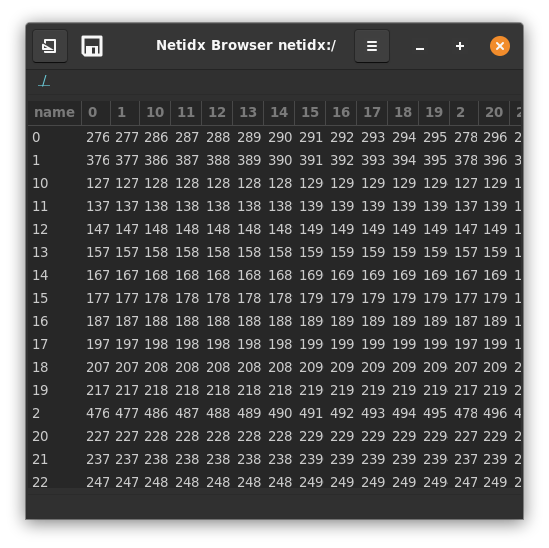

# Table



The table widget is used for displaying tabular data from netidx. It
is quite flexable, with many bscript properties, so it can be used for
many purposes such as lists. It supports direct editing, mediated by
bscript, and it can even display images, checkboxes, spin buttons, and
combo boxes in cells. Table has many bscript properties,

- path: The path to the data to be displayed. This is bscript, so if
  it updates to a new path then the table will redraw that new path.
- sort mode: This defines how sorting is done. It has the form, 

  ```
  (null | false | external | <column> | spec)
   external: [false, [spec, ...]]
   spec: [<column>, ("ascending" | "descending")]
  ```

  - null: no default sort. Sorting is processed within the browser and
    is under the control of the user. Click events will also be
    generated when the user clicks on the header button, see
    `on_header_click`.
  - false: sorting within the browser is disabled, but click events
    will still be generated when the user clicks on the header
    buttons. These events could be used to trigger publisher side
    sorting, or any other desired action. See, `on_header_click`.
  - external: just like `false`, however sort indicators will be shown
    as specified by the indicator spec. Use this if you implement
    sorting in the publisher, but want to give the user feedback about
    what is sorted. Example,
    
    `[false, [["artist", "descending"], ["album", "descending"]]]`
    
    Indicates that sorting is happening on the publisher side, but the
    indicators should be show on the artist and album columns.
  - `<column>`: by default sort by `<column>` in descending
    order. Sorting is processed within the browser and is under the
    user's control. Click events will also be generated when the user
    clicks on the header button, see `on_header_click`. Example,
    
    `"artist"`
    
    sort by the artist column descending
    
  - spec: Same as column, except the sort direction is explicitly
    specified. Example,

      `["artist", "ascending"]`
    
      sort by the artist column ascending
- selection mode: "single", "multi", or "none"
  - "single": The user can only select 1 cell at a time
  - "multi": The user can select multiple cells by holding shift while
    clicking or arrowing.
  - "none": The user can't select cells
