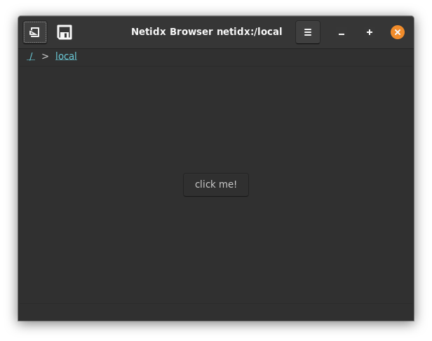
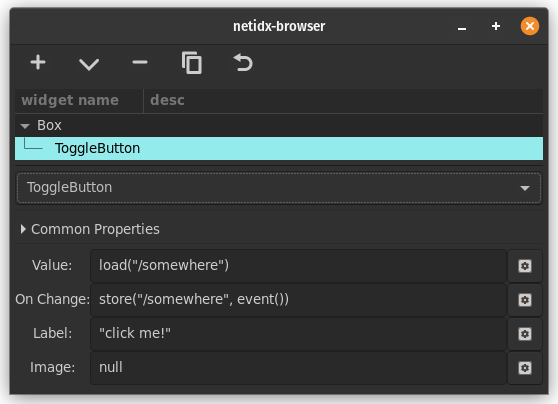

# Toggle Button

Toggle button is like a switch, it can be pushed in or out. It's state
is controlled by bscript. It has 4 bscript properties,

- Value: Whether the button is in or out. If `true` the button is in,
  if `false` the button is out.
- On Change: `event()` will yield the new requested state of the
  button. `true` for in, `false` for out.
- Label: The text displayed in the button
- Image: The image displayed in the button. This uses the same format
  as the image widget's spec property. If both text and image are
  valid then the button will have both an image and text.

