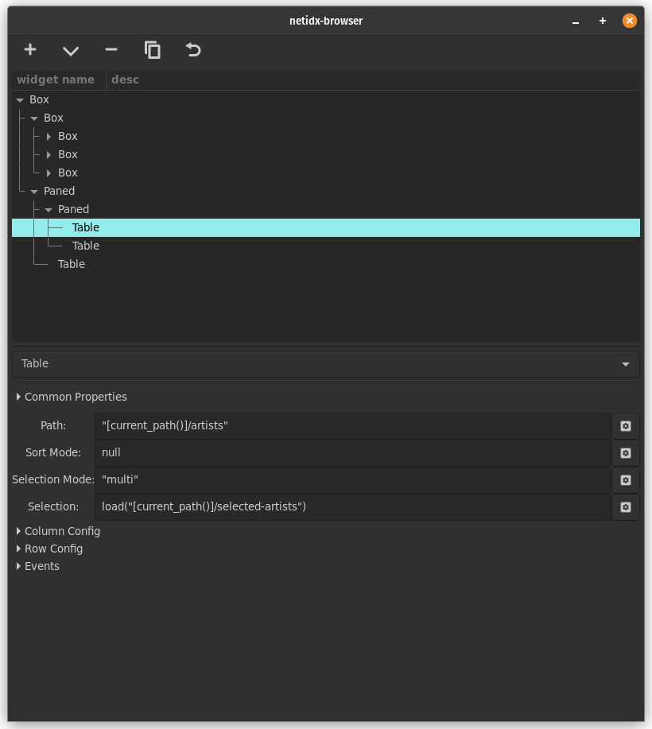
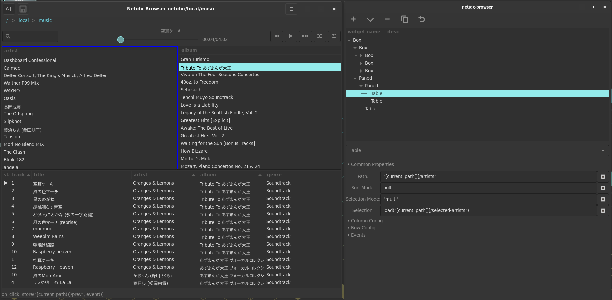

# GUI Builder

The browser is not only for displaying tables, it is a custom gui
builder with it's own embedded scripting language and access to most
of the widgets in GTK. The design mode button opens the GUI builder
window, which allows you to display and modify an existing GUI as well
as build one from scratch.

The GUI builder has two parts, starting from the top,

On top is the widget tree. Layout is automatic, and is based on the
structure of the widget tree, as such, you get the visual look you
want for your app by manipulating this tree as well as setting widget
properties. You can drag and drop nodes around, and using the buttons
just above the tree you can,

- create a sibling of the currently selected node
- create a child of the currently selected node
- delete the currently selected node as well as all of it's children
- duplicate the currently selected node as well as all of it's children
- undo

Below the widget tree the properties of the currently selected widget
are shown. This includes all visual options, as well as event
handlers.

When the GUI builder window is open, the main browser window continues
to function normally. Any changes made in the design window are
reflected immediatly in the main window. The currently selected widget
in the widget tree is highlighted in blue in the main window.

When building GUIs using the browser, most of the interesting code
should live in the publisher. However some logic specific to the user
interface may be needed, and for this there is bscript, which will be
covered in the next section.
