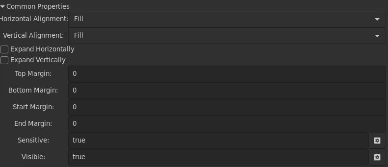

# Widgets

The browser supports several widgets. Most widgets also share common
properties, which are found under the common properties expander in
the lower half of the gui builder. The current supported common
properties are,

- Horizontal Alignment: Fill, Start, End, Center, or Baseline. Fill is the default.
- Vertical Alignment: Fill, Start, End, Center, or Baseline. Fill is the default.
- expand vertically
- expand horizontally
- top margin
- bottom margin
- start margin
- end margin.

These layout properties can be adjusted until you have the layout you
want in the main window. There are two additional properties, which
take bscript expressions instead of static values, these are

- sensitive: true if the user can interact with the widget, false otherwise
- visible: true if the widget should be drawn, false otherwise.

Since these are bscript expressions they can change at any time and
the gui will change.

