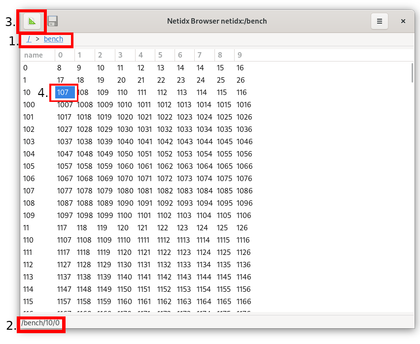

# Browser

The browser is a graphical tool that visualizes the contents of
netidx, it allows users to navigate to places of interest, view data
in tabular or vector form, and construct applications with custom
views and BScript.

Ignoring custom views, the browser attempts to infer from the
structure of the tree whether the path it's viewing should be
displayed as a vector, or a table. A vector looks like e.g.


Where as a table looks like, e.g.



The various components highlighted in red are,

1. The currently visualized path. To navigate up, you can click on any
   of the individual components, e.g. click the `/` to navigate to the
   root. You can refresh the current view by clicking the link to the
   current path, `bench` in this case. If you're viewing a custom view
   stored in a file, then this will be indicated by the current path
   changing to e.g. `file://somwhere/in/the/file/system`.
2. The gutter displays the path of the currently selected cell, or, in
   a custom view it displays the BScript bound to the currently
   selected or hovered object.
3. Design mode button, click to enter design mode. This will display
   the design of the current view, and allow you to edit it. This will
   be covered in detail in the next section.
4. The currently selected cell in a table is highlighed.

You can enter a subtree by double clicking on it. To go up, use the
path links as described in 1. You can also go directly to a path you
type in by using go from the menu.

A subtree will be visualized as a table if it contains a regular
structure of leaf nodes that are named the same thing for multiple
parents, e.g.

```
/base/row0/col0
/base/row0/col1
...
/base/rowN/col0
/base/rowN/col1
```

This will automatically visualize as a table with N rows named `row0
.. rowN` and 2 columns named `col0` and `col1`. If the regular
structure necessary to infer a table doesn't exist, then the subtree
will be visualized as a vector.
